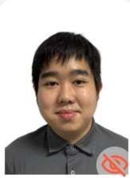
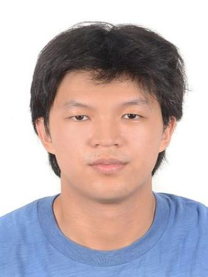
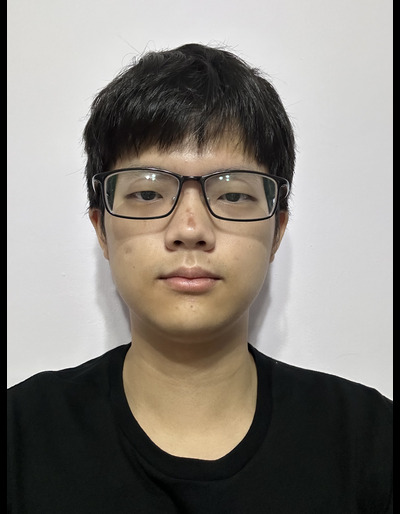
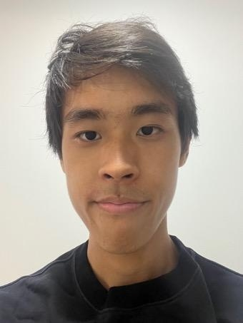
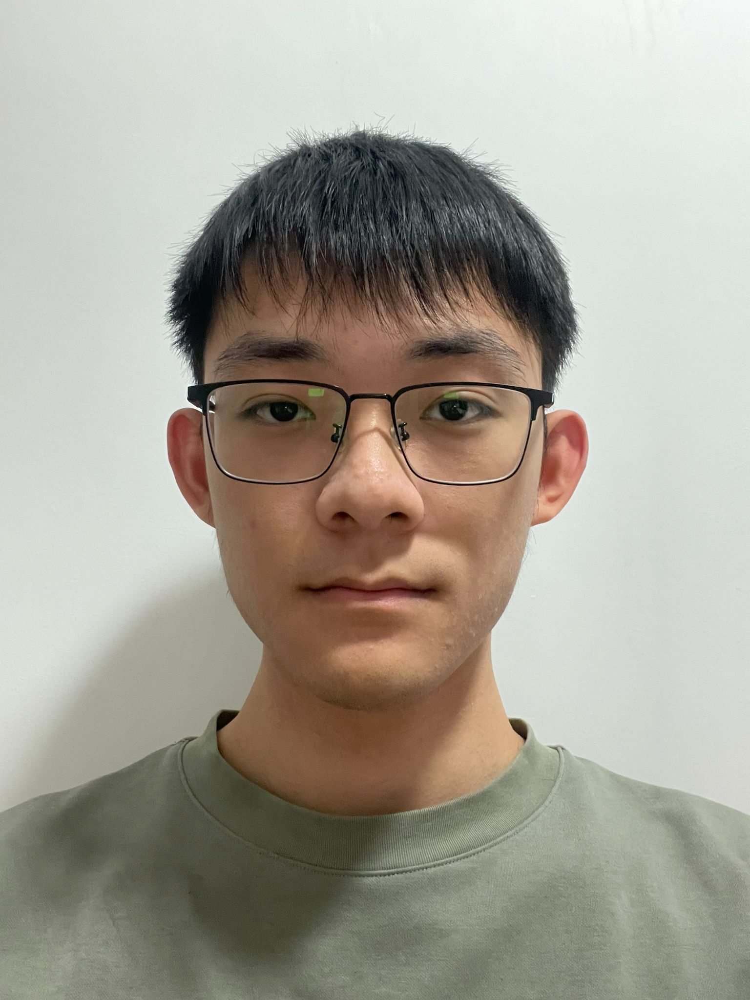

We are a team based in the [School of Computing, National University of Singapore](https://www.comp.nus.edu.sg).

You can reach us at the email `seer[at]comp.nus.edu.sg`

## Project team

### Joseph Gunawan

[[github](https://github.com/gunawanjoseph)]
[[portfolio](team/gunawanjoseph.md)]

* Role: Developer

### Teoh Kian Shen

[[github](https://github.com/kianshenteoh)]
[[portfolio](team/kianshenteoh.md)]

* Role: Developer

### Daniel Loo Kang Le

[[github](http://github.com/zzdlklzz)]
[[portfolio](team/zzdlklzz.md)]

* Role: Developer

### Andre Keh

[[github](http://github.com/lanturn567)]
[[portfolio](team/lanturn567.md)]

* Role: Developer

### Wang Yuanchi

[[github](http://github.com/wangyuanchi)]
[[portfolio](team/wangyuanchi.md)]

* Role: Developer
