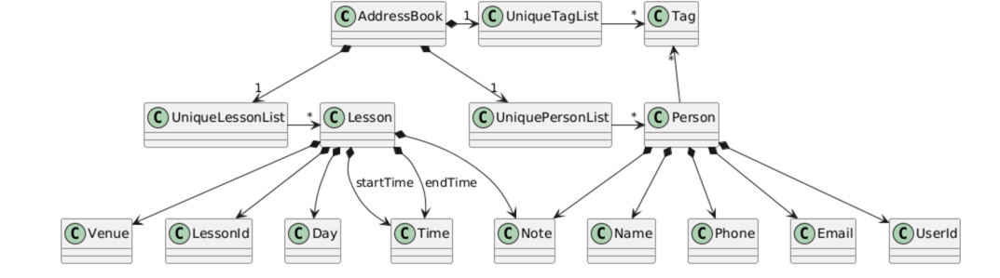
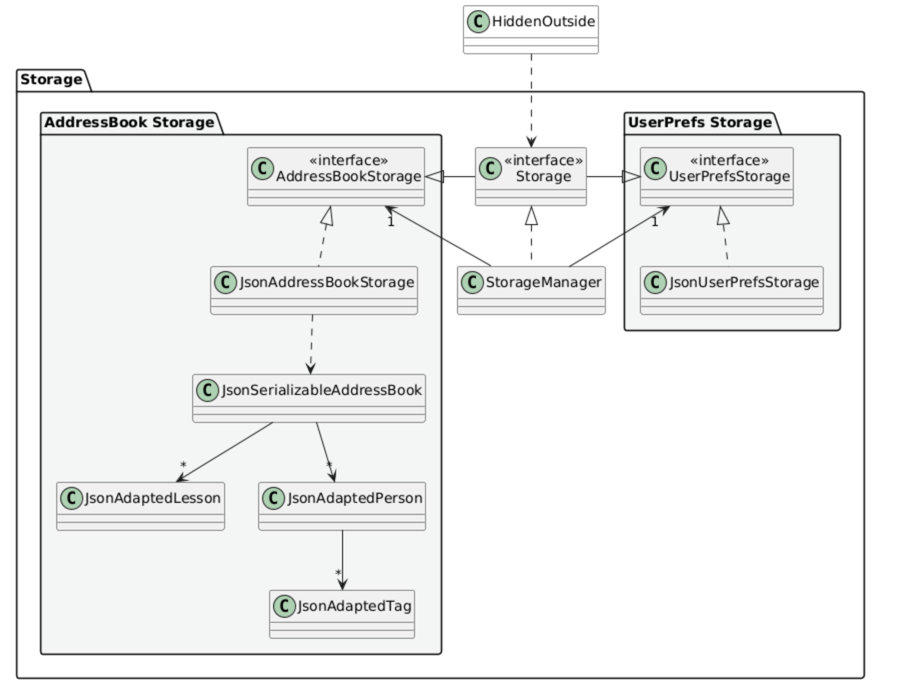

* Table of Contents
{:toc}

--------------------------------------------------------------------------------------------------------------------

## **Acknowledgements**

* This project is based on the AddressBook-Level3 project created by the [SE-EDU initiative](https://se-education.org).

--------------------------------------------------------------------------------------------------------------------

## **Setting up, getting started**

Refer to the guide [_Setting up and getting started_](SettingUp.md).

--------------------------------------------------------------------------------------------------------------------

## **Design**

:bulb: **Tip:** The `.puml` files used to create diagrams are in this document `docs/diagrams` folder. Refer to the [_PlantUML Tutorial_ at se-edu/guides](https://se-education.org/guides/tutorials/plantUml.html) to learn how to create and edit diagrams.

### Architecture

The ***Architecture Diagram*** given above explains the high-level design of the App.

Given below is a quick overview of main components and how they interact with each other.

**Main components of the architecture**

**`Main`** (consisting of classes [`Main`](https://github.com/se-edu/addressbook-level3/tree/master/src/main/java/seedu/address/Main.java) and [`MainApp`](https://github.com/se-edu/addressbook-level3/tree/master/src/main/java/seedu/address/MainApp.java)) is in charge of the app launch and shut down.
* At app launch, it initializes the other components in the correct sequence, and connects them up with each other.
* At shut down, it shuts down the other components and invokes cleanup methods where necessary.

The bulk of the app's work is done by the following four components:

* [**`UI`**](#ui-component): The UI of the App.
* [**`Logic`**](#logic-component): The command executor.
* [**`Model`**](#model-component): Holds the data of the App in memory.
* [**`Storage`**](#storage-component): Reads data from, and writes data to, the hard disk.

[**`Commons`**](#common-classes) represents a collection of classes used by multiple other components.

**How the architecture components interact with each other**

The *Sequence Diagram* below shows how the components interact with each other for the scenario where the user issues the command `deletestudent Bob 1`.

Each of the four main components (also shown in the diagram above),

* defines its *API* in an `interface` with the same name as the Component.
* implements its functionality using a concrete `{Component Name}Manager` class (which follows the corresponding API `interface` mentioned in the previous point.

For example, the `Logic` component defines its API in the `Logic.java` interface and implements its functionality using the `LogicManager.java` class which follows the `Logic` interface. Other components interact with a given component through its interface rather than the concrete class (reason: to prevent outside component's being coupled to the implementation of a component), as illustrated in the (partial) class diagram below.

The sections below give more details of each component.

### UI component

The **API** of this component is specified in [`Ui.java`](https://github.com/se-edu/addressbook-level3/tree/master/src/main/java/seedu/address/ui/Ui.java)

The UI consists of a `MainWindow` that is made up of parts e.g.`CommandBox`, `ResultDisplay`, `PersonListPanel`, `StatusBarFooter` etc. All these, including the `MainWindow`, inherit from the abstract `UiPart` class which captures the commonalities between classes that represent parts of the visible GUI.

The `UI` component uses the JavaFx UI framework. The layout of these UI parts are defined in matching `.fxml` files that are in the `src/main/resources/view` folder. For example, the layout of the [`MainWindow`](https://github.com/se-edu/addressbook-level3/tree/master/src/main/java/seedu/address/ui/MainWindow.java) is specified in [`MainWindow.fxml`](https://github.com/se-edu/addressbook-level3/tree/master/src/main/resources/view/MainWindow.fxml)

The `UI` component,

* executes user commands using the `Logic` component.
* listens for changes to `Model` data so that the UI can be updated with the modified data.
* keeps a reference to the `Logic` component, because the `UI` relies on the `Logic` to execute commands.
* depends on some classes in the `Model` component, as it displays `Person` object residing in the `Model`.

### Logic component

**API** : [`Logic.java`](https://github.com/se-edu/addressbook-level3/tree/master/src/main/java/seedu/address/logic/Logic.java)

Here's a (partial) class diagram of the `Logic` component:

The sequence diagram below illustrates the interactions within the `Logic` component, taking `execute("deletestudent Bob 1")` API call as an example.

:information_source: **Note:** The lifeline for `DeleteCommandParser` should end at the destroy marker (X) but due to a limitation of PlantUML, the lifeline continues till the end of diagram.

How the `Logic` component works:

1. When `Logic` is called upon to execute a command, it is passed to an `AddressBookParser` object which in turn creates a parser that matches the command (e.g., `DeleteCommandParser`) and uses it to parse the command.
1. This results in a `Command` object (more precisely, an object of one of its subclasses e.g., `DeleteCommand`) which is executed by the `LogicManager`.
1. The command can communicate with the `Model` when it is executed (e.g. to delete a person). 
   Note that although this is shown as a single step in the diagram above (for simplicity), in the code it can take several interactions (between the command object and the `Model`) to achieve.
1. The result of the command execution is encapsulated as a `CommandResult` object which is returned back from `Logic`.

Here are the other classes in `Logic` (omitted from the class diagram above) that are used for parsing a user command:

How the parsing works:
* When called upon to parse a user command, the `AddressBookParser` class creates an `XYZCommandParser` (`XYZ` is a placeholder for the specific command name e.g., `AddCommandParser`) which uses the other classes shown above to parse the user command and create a `XYZCommand` object (e.g., `AddCommand`) which the `AddressBookParser` returns back as a `Command` object.
* All `XYZCommandParser` classes (e.g., `AddCommandParser`, `DeleteCommandParser`, ...) inherit from the `Parser` interface so that they can be treated similarly where possible e.g, during testing.

### Model component
**API** : [`Model.java`](https://github.com/se-edu/addressbook-level3/tree/master/src/main/java/seedu/address/model/Model.java)

The `Model` component,

* stores the address book data i.e., all `Person` objects (which are contained in a `UniquePersonList` object).
* stores the currently 'selected' `Person` objects (e.g., results of a search query) as a separate _filtered_ list which is exposed to outsiders as an unmodifiable `ObservableList<Person>` that can be 'observed' e.g. the UI can be bound to this list so that the UI automatically updates when the data in the list change.
* stores a `UserPref` object that represents the user’s preferences. This is exposed to the outside as a `ReadOnlyUserPref` objects.
* does not depend on any of the other three components (as the `Model` represents data entities of the domain, they should make sense on their own without depending on other components)

:information_source: **Note:** An alternative (arguably, a more OOP) model is given below. It has a `Tag` list in the `AddressBook`, which `Person` references. This allows `AddressBook` to only require one `Tag` object per unique tag, instead of each `Person` needing their own `Tag` objects. 

### Storage component

**API** : [`Storage.java`](https://github.com/se-edu/addressbook-level3/tree/master/src/main/java/seedu/address/storage/Storage.java)

The `Storage` component,
* can save both address book data and user preference data in JSON format, and read them back into corresponding objects.
* inherits from both `AddressBookStorage` and `UserPrefStorage`, which means it can be treated as either one (if only the functionality of only one is needed).
* depends on some classes in the `Model` component (because the `Storage` component's job is to save/retrieve objects that belong to the `Model`)

### Common classes

Classes used by multiple components are in the `seedu.address.commons` package.

--------------------------------------------------------------------------------------------------------------------

## **Implementation**

This section describes some noteworthy details on how certain features are implemented.

### \[Proposed\] Undo/redo feature

#### Proposed Implementation

The proposed undo/redo mechanism is facilitated by `VersionedAddressBook`. It extends `AddressBook` with an undo/redo history, stored internally as an `addressBookStateList` and `currentStatePointer`. Additionally, it implements the following operations:

* `VersionedAddressBook#commit()` — Saves the current address book state in its history.
* `VersionedAddressBook#undo()` — Restores the previous address book state from its history.
* `VersionedAddressBook#redo()` — Restores a previously undone address book state from its history.

These operations are exposed in the `Model` interface as `Model#commitAddressBook()`, `Model#undoAddressBook()` and `Model#redoAddressBook()` respectively.

Given below is an example usage scenario and how the undo/redo mechanism behaves at each step.

Step 1. The user launches the application for the first time. The `VersionedAddressBook` will be initialized with the initial address book state, and the `currentStatePointer` pointing to that single address book state.

Step 2. The user executes `delete 5` command to delete the 5th person in the address book. The `delete` command calls `Model#commitAddressBook()`, causing the modified state of the address book after the `delete 5` command executes to be saved in the `addressBookStateList`, and the `currentStatePointer` is shifted to the newly inserted address book state.

Step 3. The user executes `add n/David …​` to add a new person. The `add` command also calls `Model#commitAddressBook()`, causing another modified address book state to be saved into the `addressBookStateList`.

:information_source: **Note:** If a command fails its execution, it will not call `Model#commitAddressBook()`, so the address book state will not be saved into the `addressBookStateList`.

Step 4. The user now decides that adding the person was a mistake, and decides to undo that action by executing the `undo` command. The `undo` command will call `Model#undoAddressBook()`, which will shift the `currentStatePointer` once to the left, pointing it to the previous address book state, and restores the address book to that state.

:information_source: **Note:** If the `currentStatePointer` is at index 0, pointing to the initial AddressBook state, then there are no previous AddressBook states to restore. The `undo` command uses `Model#canUndoAddressBook()` to check if this is the case. If so, it will return an error to the user rather
than attempting to perform the undo.

The following sequence diagram shows how an undo operation goes through the `Logic` component:

:information_source: **Note:** The lifeline for `UndoCommand` should end at the destroy marker (X) but due to a limitation of PlantUML, the lifeline reaches the end of diagram.

Similarly, how an undo operation goes through the `Model` component is shown below:

The `redo` command does the opposite — it calls `Model#redoAddressBook()`, which shifts the `currentStatePointer` once to the right, pointing to the previously undone state, and restores the address book to that state.

:information_source: **Note:** If the `currentStatePointer` is at index `addressBookStateList.size() - 1`, pointing to the latest address book state, then there are no undone AddressBook states to restore. The `redo` command uses `Model#canRedoAddressBook()` to check if this is the case. If so, it will return an error to the user rather than attempting to perform the redo.

Step 5. The user then decides to execute the command `liststudent`. Commands that do not modify the address book, such as `liststudent`, will usually not call `Model#commitAddressBook()`, `Model#undoAddressBook()` or `Model#redoAddressBook()`. Thus, the `addressBookStateList` remains unchanged.

Step 6. The user executes `clear`, which calls `Model#commitAddressBook()`. Since the `currentStatePointer` is not pointing at the end of the `addressBookStateList`, all address book states after the `currentStatePointer` will be purged. Reason: It no longer makes sense to redo the `add n/David …​` command. This is the behavior that most modern desktop applications follow.

The following activity diagram summarizes what happens when a user executes a new command:

#### Design considerations:

**Aspect: How undo & redo executes:**

* **Alternative 1 (current choice):** Saves the entire address book.
  * Pros: Easy to implement.
  * Cons: May have performance issues in terms of memory usage.

* **Alternative 2:** Individual command knows how to undo/redo by
  itself.
  * Pros: Will use less memory (e.g. for `delete`, just save the person being deleted).
  * Cons: We must ensure that the implementation of each individual command are correct.

_{more aspects and alternatives to be added}_

### \[Proposed\] Data archiving

_{Explain here how the data archiving feature will be implemented}_

--------------------------------------------------------------------------------------------------------------------

## **Documentation, logging, testing, configuration, dev-ops**

* [Documentation guide](Documentation.md)
* [Testing guide](Testing.md)
* [Logging guide](Logging.md)
* [Configuration guide](Configuration.md)
* [DevOps guide](DevOps.md)

--------------------------------------------------------------------------------------------------------------------

## **Appendix: Requirements**

### Product scope

**Target user profile**:

* manage 20–50 students and parents
* are fast typists
* work primarily on laptops
* often handle administrative tasks offline between lessons

**Value proposition**:

Private tutors waste time juggling spreadsheets, chats, and notes to manage students and parents. 

A typing-first address book for private tutors lets them:

* pull up student/parent details instantly
* group contacts by level/subject/class
* keep brief lesson/fee notes

### User stories

Priorities: High (must have) - `* * *`, Medium (nice to have) - `* *`, Low (unlikely to have) - `*`

| Priority | As a …​       | I want to …​                                  | So that I can…​                                                  |
|----------|---------------|-----------------------------------------------|------------------------------------------------------------------|
| `* * *`  | private tutor | add students and their administrative details | keep track of and contact my students easily                     |
| `* *`    | private tutor | edit students' details                        | correct mistakes I made when adding a student                    |
| `* * *`  | private tutor | delete students                               | get rid of students I am no longer teaching                      |
| `* * *`  | private tutor | search for a student                          | find out their details easily                                    |
| `* * *`  | private tutor | create lesson                                 | assign students to a lesson                                      |
| `* *`    | private tutor | edit lessons' details                         | correct any mistakes in content                                  |
| `* * *`  | private tutor | delete lesson                                 | remove a lesson that I am no longer teaching                     |
| `* * *`  | private tutor | list my lessons                               | plan my schedule                                                 |
| `* * *`  | private tutor | assign a student to a lesson                  | manage my student more easily                                    |
| `* * *`  | private tutor | unassign a student from a lesson              | manage my student more easily                                    |
| `* *`    | private tutor | filter students by lesson                     | prepare more individualized content for my upcoming lesson       |
| `* *`    | private tutor | filter lessons by student                     | review upcoming lessons for my student and tailor my preparation |
| `* *`    | private tutor | search for lessons by day                     | find my upcoming lessons more quickly                            |

*{More to be added}*

### Use cases

(For all use cases below, the **System** is the `EduLink` and the **Actor** is the `user`, unless specified otherwise)

**Use case: UC01 - Add student**

**Guarantees**

* Student records are stored in the system with a unique ID.
* All data is validated and normalized.
* Tutor sees a confirmation message with student details.

**MSS**

1. Tutor chooses to add new student.
2. EduLink validates the data provided.
3. EduLink assigns a unique ID to the student.
4. EduLink stores the student record.
5. EduLink displays a success message showing the student details.

   Use case ends.

**Extensions**

* 2a. Any field fails validation.
  * 2a1. EduLink shows an error. 

    Use case ends.

* 4a. Error on storing student record.
  * 4a1. EduLink displays an error.

    Use case ends.

**Use case: UC02 - Delete student**

**Preconditions**

* At least one student exists in the system.

**Guarantees**

* Student record is removed from the system.
* Tutor sees a confirmation message with deleted student details.

**MSS**

1. Tutor chooses to delete a particular student from the system.
2. EduLink searches for and displays a list of matching students.
3. EduLink prompts Tutor to select a student.
4. Tutor chooses the desired student to delete.
5. EduLink deletes the student.
6. EduLink displays a success message.

   Use case ends.

**Extensions**

* 2a. No student matches the given name.
  * 2a1. EduLink displays an error.
    
    Use case ends.

* 4a. Tutor chooses invalid student.
  * 4a1. EduLink displays an error.

    Use case ends.

**Use case: UC03 - Find student**

**MSS**

1. Tutor searches for student. 
2. EduLink searches for all students matching the name. 
3. EduLink displays all matching students with their details.

   Use case ends.

**Extensions**

* 2a. No student matches the name.
  * 2a1. EduLink shows an error.
    
    Use case ends.

**Use case: UC04 - List students**

**MSS**

1. Tutor chooses to display list of students. 
2. EduLink retrieves all students. 
3. EduLink displays the full list of students.

   Use case ends.

**Extensions**

* 2a. There are no students added yet.
  * 2a1. EduLink shows an error.

    Use case ends.

**Use case: UC05 - Add lesson**

**Guarantees**

* Lesson records are stored in the system with a unique ID.
* All data is validated and normalized.
* Tutor sees a confirmation message with lesson details.

**MSS**

1. Tutor chooses to add new lesson.
2. EduLink validates the data provided.
3. EduLink assigns a unique ID to the lesson.
4. EduLink stores the lesson record.
5. EduLink displays a success message showing the lesson details.

   Use case ends.

**Extensions**

* 2a. Any field fails validation.
    * 2a1. EduLink shows an error.

      Use case ends.

* 4a. Error on storing lesson record.
    * 4a1. EduLink displays an error.

      Use case ends.

**Use case: UC06 - Delete lesson**

**Preconditions**

* At least one lesson exists in the system.

**Guarantees**

* Lesson record is removed from the system.
* Tutor sees a confirmation message with deleted lesson details.

**MSS**

1. Tutor chooses to delete a particular lesson from the system.
2. EduLink deletes the lesson.
3. EduLink displays a success message.

   Use case ends.

**Extensions**

* 1a. No lesson matches the given ID.
    * 1a1. EduLink displays an error.

      Use case ends.

**Use case: UC07 - List lessons**

**MSS**

1. Tutor chooses to display list of lessons.
2. EduLink retrieves all lessons.
3. EduLink displays the full list of lessons.

   Use case ends.

**Extensions**

* 2a. There are no lessons added yet.
    * 2a1. EduLink shows an error.

      Use case ends.

**Use case: UC08 - Edit student**

**Preconditions**

* At least one student exists in the system.

**Guarantees**

* Tutor sees a confirmation message with edited student details.

**MSS**

1. Tutor chooses to edit a particular student from the system.
2. EduLink edits the student.
3. EduLink displays a success message.

   Use case ends.

**Extensions**

* 1a. No student matches the given index.
    * 1a1. EduLink displays an error.

      Use case ends.

* 1b. Input data fails validation.
    * 1b1. EduLink displays an error.

      Use case ends.

**Use case: UC09 - Edit lesson**

**Preconditions**

* At least one lesson exists in the system.

**Guarantees**

* Tutor sees a confirmation message with edited lesson details.

**MSS**

1. Tutor chooses to edit a particular lesson from the system.
2. EduLink edits the lesson.
3. EduLink displays a success message.

   Use case ends.

**Extensions**

* 1a. No lesson matches the given index.
    * 1a1. EduLink displays an error.

      Use case ends.

* 1b. Input data fails validation.
    * 1b1. EduLink displays an error.

      Use case ends.

**Use case: UC10 - Assign student to lesson**

**Preconditions**

* At least one student exists in the system.
* At least one lesson exists in the system.

**Guarantees**

* Student is assigned to the specified lesson.
* Lesson is added to the student's lesson list.
* Tutor sees a confirmation message showing the assignment.

**MSS**

1. Tutor chooses to assign a student to a lesson by providing student name and lesson day.
2. EduLink searches for and displays matching students with the given name.
3. Tutor selects the desired student by providing an index.
4. EduLink displays matching lessons on the specified day.
5. Tutor selects the desired lesson by providing an index.
6. EduLink validates that the student is not already assigned to this lesson.
7. EduLink assigns the student to the lesson.
8. EduLink displays a success message with assignment details.

   Use case ends.

**Extensions**

* 1a. Tutor provides all parameters (name, student index, day, and lesson index) at once.
    * 1a1. EduLink validates all parameters and assignment constraints.
    * 1a2. EduLink assigns the student to the lesson instantly.
    * 1a3. EduLink displays a success message with assignment details.

      Use case ends.
    
    * 1a1a. Validation fails for any parameter or constraint.
        * 1a1a1. EduLink displays an error.
        
          Use case ends.

* 2a. No student matches the given name.
    * 2a1. EduLink displays an error.

      Use case ends.

* 3a. Tutor provides an invalid student index.
    * 3a1. EduLink displays an error.

      Use case ends.

* 4a. No lesson matches the given day.
    * 4a1. EduLink displays an error.

      Use case ends.

* 5a. Tutor provides an invalid lesson index.
    * 5a1. EduLink displays an error.

      Use case ends.

* 6a. Student is already assigned to the lesson.
    * 6a1. EduLink displays an error indicating the student is already assigned.

      Use case ends.

**Use case: UC11 - Unassign student from lesson**

**Preconditions**

* At least one student exists in the system.
* At least one lesson exists in the system.
* The student must be currently assigned to the lesson.

**Guarantees**

* Student is unassigned from the specified lesson.
* Lesson is removed from the student's lesson list.
* Tutor sees a confirmation message showing the unassignment.

**MSS**

1. Tutor chooses to unassign a student from a lesson by providing student name and lesson day.
2. EduLink searches for and displays matching students with the given name.
3. Tutor selects the desired student by providing an index.
4. EduLink displays matching lessons on the specified day.
5. Tutor selects the desired lesson by providing an index.
6. EduLink validates that the student is currently assigned to this lesson.
7. EduLink unassigns the student from the lesson.
8. EduLink displays a success message with unassignment details.

   Use case ends.

**Extensions**

* 1a. Tutor provides all parameters (name, student index, day, and lesson index) at once.
    * 1a1. EduLink validates all parameters and unassignment constraints.
    * 1a2. EduLink unassigns the student from the lesson instantly.
    * 1a3. EduLink displays a success message with unassignment details.

      Use case ends.
    
    * 1a1a. Validation fails for any parameter or constraint.
        * 1a1a1. EduLink displays an error.
        
          Use case ends.

* 2a. No student matches the given name.
    * 2a1. EduLink displays an error.

      Use case ends.

* 3a. Tutor provides an invalid student index.
    * 3a1. EduLink displays an error.

      Use case ends.

* 4a. No lesson matches the given day.
    * 4a1. EduLink displays an error.

      Use case ends.

* 5a. Tutor provides an invalid lesson index.
    * 5a1. EduLink displays an error.

      Use case ends.

* 6a. Student is not currently assigned to the lesson.
    * 6a1. EduLink displays an error indicating the student is not assigned to this lesson.

      Use case ends.

**Use case: UC12 - Filter students by lesson**

**Preconditions**

* At least one lesson exists in the system.

**Guarantees**

* A list of students associated with the selected lesson is displayed.

**MSS**

1. Tutor chooses to filter students by a specific lesson.
2. EduLink locates the selected lesson.
3. EduLink retrieves all students associated with that lesson.
4. EduLink displays the list of students with their details.

   Use case ends.

**Extensions**

* 2a. The selected lesson does not exist.
  * 2a1. EduLink displays an error.

       Use case ends.

* 3a. The lesson exists but has no associated students.
  * 3a1. EduLink displays a “no students found” message.

       Use case ends.

**Use case: UC13 - Filter lessons by student**

**Preconditions**

* At least one student exists in the system.

**Guarantees**

* A list of lessons associated with the selected student is displayed.

**MSS**

1. Tutor chooses to filter lessons by a specific student.
2. EduLink locates the selected student.
3. EduLink retrieves all lessons associated with that student.
4. EduLink displays the list of lessons with their details.

  Use case ends.

**Extensions**

* 2a. The selected student does not exist.
  * 2a1. EduLink displays an error.

     Use case ends.

* 3a. The student exists but has no associated lessons.
  * 3a1. EduLink displays a “no lessons found” message.

     Use case ends.

*{More to be added}*

### Non-Functional Requirements

1.  Should work on any _mainstream OS_ as long as it has Java `17` or above installed.
2.  Should be able to hold up to 1000 persons without a noticeable sluggishness in performance for typical usage.
3.  A user with above average typing speed for regular English text (i.e. not code, not system admin commands) should be able to accomplish most of the tasks faster using commands than using the mouse.
4.  Should launch and be ready to accept commands within **3 seconds** on a modern laptop (Intel i5/Ryzen 5 and above, 8GB RAM)
5.  Should save all data **instantly upon any update** (e.g. add/delete student) to prevent data loss in case of abrupt shutdown.
6.  Must not require Internet connectivity for core functionality (adding, finding, grouping contacts, adding notes)
7.  The application should remain usable even when run offline between lessons, with all data persisted locally.

*{More to be added}*

### Glossary

* **Mainstream OS**: Windows, Linux, Unix, MacOS
* **Private contact detail**: A contact detail that is not meant to be shared with others
* **Typing-first interface**: A design approach where users primarily interact with the system through typed commands instead of mouse-driven GUI.
* **Student Record**: The collection of information tied to a student, including contact details, fee notes, and lessons/strengths/weaknesses notes
* **Group**: A collection of students, grouped by subject, level or class (e.g. "H2 Math, J2 Tuesday Class")
* **Fee Note**: A short record indicating the amount due and due date for tuition payments.
* **Archive**: Action of removing graduated students from the active list while still keeping their past data for reference.

--------------------------------------------------------------------------------------------------------------------

## **Appendix: Instructions for manual testing**

Given below are instructions to test the app manually.

:information_source: **Note:** These instructions only provide a starting point for testers to work on;
testers are expected to do more *exploratory* testing.

### Launch and shutdown

1. Initial launch

   1. Download the jar file and copy into an empty folder

   1. Double-click the jar file Expected: Shows the GUI with a set of sample contacts. The window size may not be optimum.

1. Saving window preferences

   1. Resize the window to an optimum size. Move the window to a different location. Close the window.

   1. Re-launch the app by double-clicking the jar file. 
       Expected: The most recent window size and location is retained.

1. _{ more test cases …​ }_

### Deleting a person

1. Deleting a person while all persons are being shown

   1. Prerequisites: List all persons using the `liststudent` command. Multiple persons in the list.

   1. Test case: `deletestudent Bob 1` 
      Expected: First contact named Bob is deleted from the list. Details of the deleted contact shown in the status message. Timestamp in the status bar is updated.

   1. Test case: `deletestudent Bob 0` 
      Expected: No person is deleted. Error details shown in the status message. Status bar remains the same.

   1. Other incorrect delete commands to try: `deletestudent`, `deletestudent Bob x`, `...` (where x is larger than the list size) 
      Expected: Similar to previous.

1. _{ more test cases …​ }_

### Saving data

1. Dealing with missing/corrupted data files

   1. _{explain how to simulate a missing/corrupted file, and the expected behavior}_

1. _{ more test cases …​ }_
