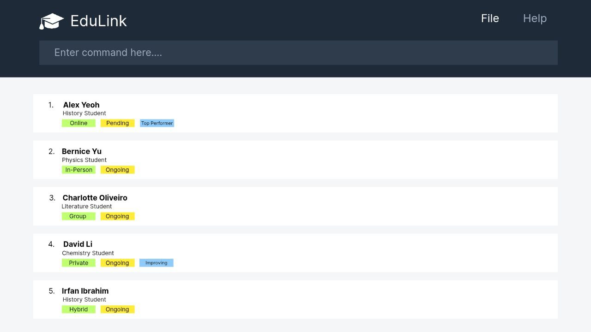

EduLink is a **desktop app for managing your students' contacts and other details, optimized for use via a Command Line Interface** (CLI) while still having the benefits of a Graphical User Interface (GUI). If you can type fast, EduLink can get your student management tasks done faster than traditional GUI apps.

* Table of Contents
{:toc}

--------------------------------------------------------------------------------------------------------------------

## Quick start

1. Ensure you have Java `17` or above installed in your Computer. 
   **Mac users:** Ensure you have the precise JDK version prescribed [here](https://se-education.org/guides/tutorials/javaInstallationMac.html).

1. Download the latest `.jar` file from [here](https://github.com/se-edu/addressbook-level3/releases).

1. Copy the file to the folder you want to use as the _home folder_ for your AddressBook.

1. Open a command terminal, `cd` into the folder you put the jar file in, and use the `java -jar addressbook.jar` command to run the application. 
   A GUI similar to the below should appear in a few seconds. Note how the app contains some sample data. 
   

1. Type the command in the command box and press Enter to execute it. e.g. typing **`help`** and pressing Enter will open the help window. 
   Some example commands you can try:

   * `liststudent` : Lists all students.

   * `add n/John Doe p/98765432 e/johnd@example.com` : Adds a contact named `John Doe` to the Address Book.

   * `addlesson d/Tue st/1500 et/1700 v/Ang Mo Kio Block 52 #12-34 ln/English Lesson` : Adds a lesson with given fields to the Address Book.

   * `deletestudent Bob 1` : Deletes the 1st student named Bob shown in the current list.   

   * `deletelesson 1` : Deletes the lesson with the ID of 1 in the Lesson List.

   * `clear` : Deletes all contacts.

   * `exit` : Exits the app.

1. Refer to the [Features](#features) below for details of each command.

--------------------------------------------------------------------------------------------------------------------

## Features

**:information_source: Notes about the command format:** 

* Words in `UPPER_CASE` are the parameters to be supplied by the user. 
  e.g. in `add n/NAME`, `NAME` is a parameter which can be used as `add n/John Doe`.

* Items in square brackets are optional. 
  e.g `n/NAME [t/TAG]` can be used as `n/John Doe t/friend` or as `n/John Doe`.

* Items with `…`​ after them can be used multiple times including zero times. 
  e.g. `[t/TAG]…​` can be used as ` ` (i.e. 0 times), `t/friend`, `t/friend t/family` etc.

* Parameters can be in any order. 
  e.g. if the command specifies `n/NAME p/PHONE_NUMBER`, `p/PHONE_NUMBER n/NAME` is also acceptable.

* Extraneous parameters for commands that do not take in parameters (such as `help`, `liststudent`, `exit` and `clear`) will be ignored. 
  e.g. if the command specifies `help 123`, it will be interpreted as `help`.

* If you are using a PDF version of this document, be careful when copying and pasting commands that span multiple lines as space characters surrounding line-breaks may be omitted when copied over to the application.

### Viewing help : `help`

Shows a message explaining how to access the help page.

Format: `help`

### Adding a student: `addstudent`

Adds a student to the address book.

Format: `addstudent n/NAME p/PHONE_NUMBER e/EMAIL [sn/STUDENT_NOTE] [t/TAG]…​`

:bulb: **Tip:**
A student can have any number of tags (including 0)

* EMAIL should be of the format local-part@domain and adhere to the following constraints:
  * The local-part should only contain alphanumeric characters and these special characters, excluding the parentheses, (+_.-). The local-part may not start or end with any special characters.
  * This is followed by a '@' and then a domain name. The domain name is made up of domain labels separated by periods.

* The domain name must:
  * end with a domain label at least 2 characters long
  * have each domain label start and end with alphanumeric characters
  * have each domain label consist of alphanumeric characters, separated only by hyphens, if any.

Examples:
* `addstudent n/John Doe p/98765432 e/johnd@example.com sn/birthday boy`
* `addstudent n/Betsy Crowe t/friend e/betsycrowe@example.com p/1234567 t/criminal`

### Listing all students : `liststudent`

Shows a list of all students in the address book.

Format: `liststudent`

### Editing a student : `editstudent`

Edits an existing student in the address book.

Format: `editstudent INDEX [n/NAME] [p/PHONE] [e/EMAIL] [t/TAG]…​`

* Edits the student at the specified `INDEX`. The index refers to the index number shown in the displayed student list. The index **must be a positive integer** 1, 2, 3, …​
* At least one of the optional fields must be provided.
* Existing values will be updated to the input values.
* When editing tags, the existing tags of the student will be removed i.e adding of tags is not cumulative.
* You can remove all the student’s tags by typing `t/` without
    specifying any tags after it.

Examples:
*  `editstudent 1 p/91234567 e/johndoe@example.com` Edits the phone number and email address of the 1st student to be `91234567` and `johndoe@example.com` respectively.
*  `editstudent 2 n/Betsy Crower t/` Edits the name of the 2nd student to be `Betsy Crower` and clears all existing tags.

### Locating persons by name: `findstudent`

Finds persons whose names contain any of the given keywords.

Format: `findstudent KEYWORD [MORE_KEYWORDS]`

* The search is case-insensitive. e.g `hans` will match `Hans`
* The order of the keywords does not matter. e.g. `Hans Bo` will match `Bo Hans`
* Only the name is searched.
* Partial words will be matched e.g. `Han` will match `Hans`
* Persons matching at least one keyword will be returned (i.e. `OR` search).
  e.g. `Hans Bo` will return `Hans Gruber`, `Bo Yang`

Examples:
* `findstudent John` returns `john` and `John Doe`
* `findstudent alex david` returns `Alex Yeoh`, `David Li` 
  

### Deleting a student : `deletestudent`

Deletes the specified student from the address book.

Format: `deletestudent NAME INDEX`

* Deletes the student with the specified `NAME` at the specified `INDEX`.
* The index refers to the index number shown in the displayed student list.
* The index **must be a positive integer** 1, 2, 3, …​

Examples:
* `deletestudent David` brings up a filtered list of students containing the name 'David'. 
Following that with `deletestudent David 1` deletes the 1st student in that list.

### Clearing all entries : `clear`

Clears all entries from the address book.

Format: `clear`

### Adding a lesson : `addlesson`

Adds a lesson to the address book.

Format: `addlesson [d/DAY] [st/START_TIME] [et/END_TIME] [v/VENUE] [ln/LESSON_NOTE]`

* Adds a new lesson with the specified details.
* START_TIME and END_TIME should be in 24-hour format (e.g. 1300, 0930).

Examples:
* `addlesson d/Mon st/0800 et/1000 v/Room 204 ln/Mathematics`
* `addlesson d/Tue st/1500 et/1700 v/Ang Mo Kio Block 52 #12-34 ln/English`

### Listing all lessons : `listlesson`

Shows a list of all lessons in the address book.

Format: `listlesson`

### Deleting a lesson : `deletelesson`

Deletes the specified lesson from the address book.

Format: `deletelesson DAY INDEX`

* Deletes the lesson of the specific `DAY` at the specified `INDEX`.
* The index refers to the index number shown in the displayed lesson list.
* The index **must be a positive integer** 1, 2, 3, …​

Examples:
* `deletelesson TUE` brings up a filtered list of lessons of the day `TUE`.
Following that with `deletelesson TUE 2` deletes the 2nd lesson in that list.

### Editing a person : `editlesson`

Edits an existing lesson in the address book.

Format: `editlesson INDEX [d/DAY] [st/START_TIME] [et/END_TIME] [v/VENUE] [ln/LESSON_NOTE]`

* Edits the lesson at the specified `INDEX`. The index refers to the index number shown in the displayed lesson list. The index **must be a positive integer** 1, 2, 3, …​
* At least one of the optional fields must be provided.
* Existing values will be updated to the input values.

Examples:
*  `editlesson 1 d/MON st/1200` Edits the day and start time of the 1st lesson to be `MON` and `1200` respectively.
*  `editlesson 2 et/1400 v/Apple Store` Edits the end time and venue of the 2nd person to be `1400` and `Apple Store` respectively.

### Exiting the program : `exit`

Exits the program.

Format: `exit`

### Saving the data

AddressBook data are saved in the hard disk automatically after any command that changes the data. There is no need to save manually.

### Editing the data file

AddressBook data are saved automatically as a JSON file `[JAR file location]/data/addressbook.json`. Advanced users are welcome to update data directly by editing that data file.

:exclamation: **Caution:**
If your changes to the data file makes its format invalid, AddressBook will discard all data and start with an empty data file at the next run. Hence, it is recommended to take a backup of the file before editing it. 
Furthermore, certain edits can cause the AddressBook to behave in unexpected ways (e.g., if a value entered is outside of the acceptable range). Therefore, edit the data file only if you are confident that you can update it correctly.

### Archiving data files `[coming in v2.0]`

_Details coming soon ..._

--------------------------------------------------------------------------------------------------------------------

## FAQ

**Q**: How do I transfer my data to another Computer? 
**A**: Install the app in the other computer and overwrite the empty data file it creates with the file that contains the data of your previous AddressBook home folder.

--------------------------------------------------------------------------------------------------------------------

## Known issues

1. **When using multiple screens**, if you move the application to a secondary screen, and later switch to using only the primary screen, the GUI will open off-screen. The remedy is to delete the `preferences.json` file created by the application before running the application again.
2. **If you minimize the Help Window** and then run the `help` command (or use the `Help` menu, or the keyboard shortcut `F1`) again, the original Help Window will remain minimized, and no new Help Window will appear. The remedy is to manually restore the minimized Help Window.

--------------------------------------------------------------------------------------------------------------------

## Command summary

Action | Format, Examples
--------|------------------
**Add Student** | `add n/NAME p/PHONE_NUMBER e/EMAIL [sn/STUDENT_NOTE] [t/TAG]…​`  e.g., `add n/James Ho p/22224444 e/jamesho@example.com sn/needs help with math t/friend t/colleague`
**List Students** | `liststudent`
**Edit Student** | `edit INDEX [n/NAME] [p/PHONE_NUMBER] [e/EMAIL] [sn/STUDENT_NOTE] [t/TAG]…​`  e.g., `edit 2 n/James Lee e/jameslee@example.com sn/improved performance`
**Find Student** | `findstudent KEYWORD [MORE_KEYWORDS]`  e.g., `findstudent James Jake`
**Delete Student** | `delete NAME INDEX`  e.g., `delete Betsy 1`
**Clear Students** | `clear`
**Add Lesson** | `addlesson [d/DAY] [st/START_TIME] [et/END_TIME] [v/VENUE] [ln/LESSON_NOTE]`  e.g., `addlesson d/Mon st/0800 et/1000 v/Room 204 ln/Mathematics`
**List Lessons** | `listlesson`
**Delete Lesson** | `deletelesson INDEX`  e.g., `deletelesson 2`
**Edit Lesson** | `editlesson INDEX [d/DAY] [st/START_TIME] [et/END_TIME] [v/VENUE] [ln/LESSON_NOTE]`   e.g., `editlesson 2 d/MON st/1200 et/1500 v/Apple Store`
**Help** | `help`
**Exit** | `exit`
