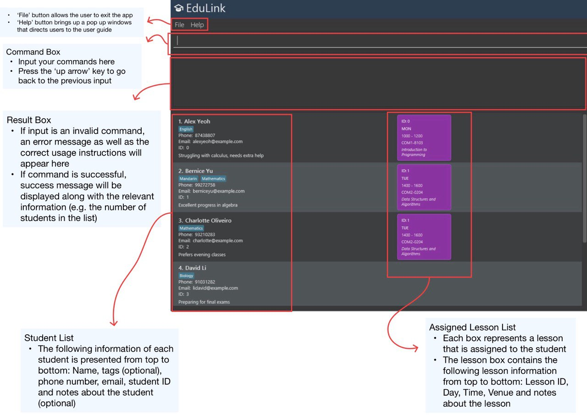
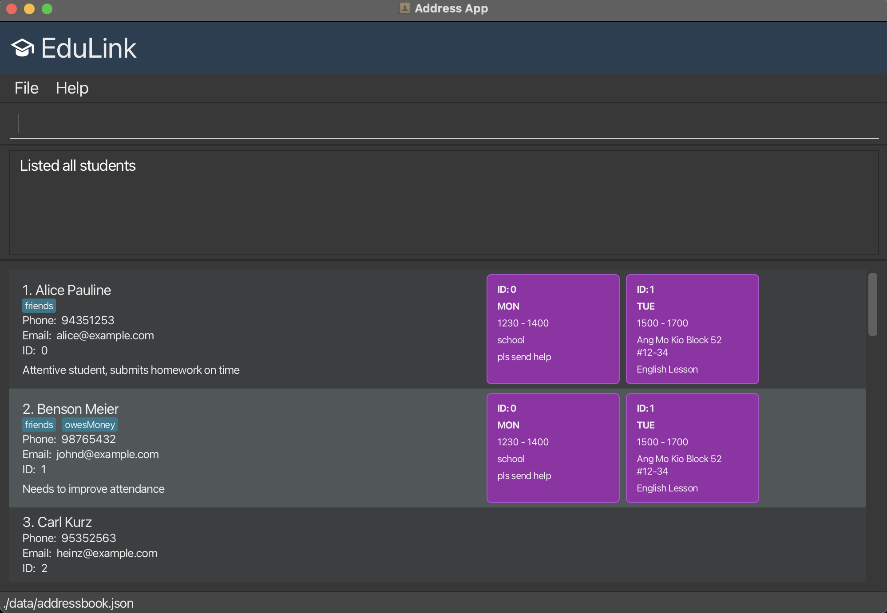
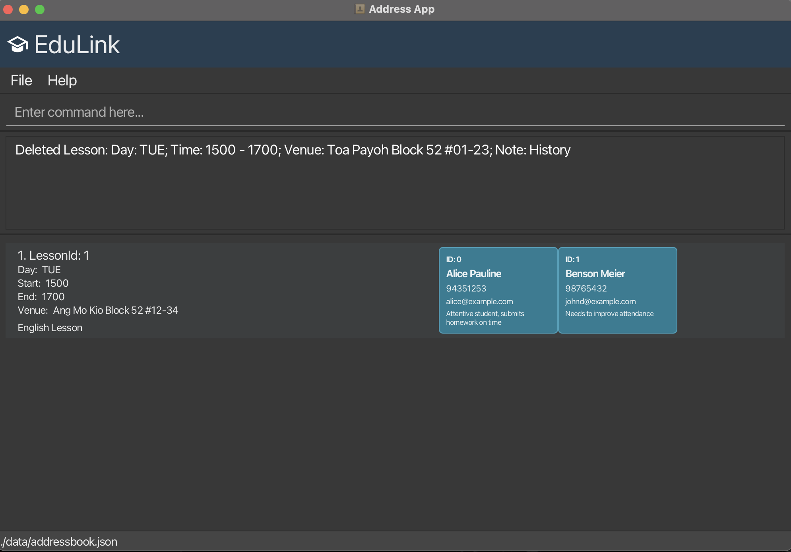

EduLink is a **desktop app designed for independent JC tutors who are fast typists**, to 
aid in managing your students' details and their assigned lessons, 
optimized for use via typed commands while still having the 
benefits of a visual User Interface (UI). 
If you can type fast, EduLink can get your student management tasks done faster 
than  traditional point-and-click apps.

* Table of Contents
{:toc}

--------------------------------------------------------------------------------------------------------------------

## Quick start

1. Ensure you have Java `17` or above installed in your Computer. Installation links for each operating system are provided below<br>

   * [Mac Users](https://se-education.org/guides/tutorials/javaInstallationMac.html)
   * [Windows Users](https://se-education.org/guides/tutorials/javaInstallationWindows.html)
   * [Linux Users](https://se-education.org/guides/tutorials/javaInstallationLinux.html)

2. Download the latest `.jar` file from [here](https://github.com/AY2526S1-CS2103T-W08-3/tp/releases/).

3. Create an empty folder on your desktop and move the `.jar` file to it.

4. Open a command terminal on your desktop. If the name of the folder containing the jar file is, for example,
   _test-edulink_, input `cd test-edulink`, and then input the `java -jar edulink.jar` command to 
   run the application.<br>
   The app, containing some sample data will appear in a few seconds.<br>

5. Below is a quick walkthrough of the EduLink UI.

<u>Students page</u>
   
<u>Lessons page</u>
    

6. Refer to the [Features](#features) section below for details of each command.
--------------------------------------------------------------------------------------------------------------------

## Features

<div markdown="block" class="alert alert-info">

**:information_source: Important notes about the command format:**<br>

* Words in `UPPER_CASE` are the parameters to be supplied by the user.<br>
  e.g. in `add n/NAME`, `NAME` is a parameter which can be used as `add n/John Doe`.

* Items in square brackets are optional.<br>
  e.g `n/NAME [t/TAG]` can be used as `n/John Doe t/friend` or as `n/John Doe`.

* Items with `…`​ after them can be used multiple times including zero times.<br>
  e.g. `[t/TAG]…​` can be used as ` ` (i.e. 0 times), `t/friend`, `t/friend t/family` etc.

* Parameters can be in any order.<br>
  e.g. if the command specifies `n/NAME p/PHONE_NUMBER`, `p/PHONE_NUMBER n/NAME` is also acceptable.

* Extraneous parameters for commands that do not take in parameters (such as `help`, `liststudent`, `listlesson` and `exit`) will be ignored.<br>
  e.g. if the command specifies `help 123`, it will be interpreted as `help`.

* If you are using a PDF version of this document, be careful when copying and pasting commands that span multiple lines as space characters surrounding line-breaks may be omitted when copied over to the application.
</div>

##### Note: Pressing the 'up arrow' key on your keyboard restores the previous input into the command box, which can come in handy for certain commands!

### Viewing help : `help`

Shows a message explaining how to access the help page.


Format: `help`

### Adding a student: `addstudent`

Adds a student to the address book.

Format: `addstudent n/NAME p/PHONE_NUMBER e/EMAIL [sn/STUDENT_NOTE] [t/TAG]…​`

<div markdown="span" class="alert alert-primary">:bulb: **Tip:**
A student can have any number of tags (including 0)
</div>

* `PHONE_NUMBER` should only contain numbers, and it should be at least 3 digits long

* `EMAIL` should be of the format _local-part@domain_ and adhere to the following constraints:
  * The _local-part_ should only contain alphanumeric characters and the following special characters ```+``` ```_``` ```.``` ```-```. 
  * Exceptions: The local-part may not start or end with any special characters, and there should not be consecutive occurrences of these characters.
  * This is followed by a '@' and then a _domain_ name. The _domain_ name is made up of _domain_ labels separated by periods.
  * Example: If a domain name is ```example.com```, the domain labels are ```example``` and ```com```.


* The _domain_ name must:
  * end with a _domain_ label at least 2 characters long
  * have each _domain_ label start and end with alphanumeric characters
  * have each _domain_ label consist of alphanumeric characters, separated only by hyphens, if any.
* Duplicate students are allowed, they are handled by a unique auto-generated index.  

* `Tag` should be alphanumeric and maximally be 50 characters long.
Examples:
* `addstudent n/John Doe p/98765432 e/johnd@example.com sn/birthday boy`
* `addstudent n/Betsy Crowe t/friend e/betsycrowe@example.com p/93847234 t/student`

Results for `addstudent n/Betsy Crowe t/friend e/betsycrowe@example.com p/93847234 t/student`:


### Listing all students : `liststudent`

Shows a list of all students in the address book.

Format: `liststudent`

Results for `liststudent`:



### Editing a student : `editstudent`

Edits an existing student in the address book.

Format: `editstudent INDEX [n/NAME] [p/PHONE] [e/EMAIL] [sn/STUDENT_NOTE] [t+/TAG]… [t-/TAG]…​`

* Editing student information is only allowed when a **list of students is currently displayed.**
* Edits the student at the specified `INDEX`. The index refers to the index number shown in the displayed student list. 
    The index **must be a positive integer** 1, 2, 3, …​ that **corresponds to a student index**.
* **At least one** of the optional parameters must be provided.
* Existing values will be updated to the input values.
* The `t+/` flag adds the specified tag while the `t-/` flag removes the specified tag.

Examples:
*  `editstudent 1 p/91234567 e/johndoe@example.com` Edits the phone number and email address of the 1st student to be `91234567` and `johndoe@example.com` respectively.
*  `editstudent 2 n/Betsy Crower t+/Physics` Edits the name of the 2nd student to be `Betsy Crower` and adds a tag labelled Physics.

Results for `editstudent 2 n/Betsy Crower t+/Physics`:


### Locating persons by name: `findstudent`

Finds persons whose names contain any of the given keywords.

Format: `findstudent KEYWORD`

* The search is case-insensitive. e.g `hans` will match `Hans`
* Only the name is searched.
* All names containing `KEYWORD` will be displayed.

Examples:
* `findstudent John` returns `john` and `John Doe`
* `findstudent john s` returns `John Smith`, `John Sigma`<br>

Results for `findstudent john s`:


### Deleting a student : `deletestudent`

Deletes the specified student from the address book.

Format: `deletestudent n/NAME i/INDEX`

* Deletes the student with the specified `NAME` at the specified `INDEX`.
* If the`NAME` parameter is present but not the `INDEX` parameter, a filtered list of students containing `NAME` will be displayed
* The index refers to the index number shown in the displayed student list, which **must be a positive integer.**
* Deleting of student information is only allowed when a list of students are displayed on the screen
* Pressing the 'up arrow' key to restore the previous input is useful for this command

Examples:
* `deletestudent n/David` brings up a filtered list of students containing the name 'David'. 
Following that with `deletestudent n/David i/1` deletes the 1st student in that list.

Results for `deletestudent n/Betsy i/2`:


### Adding a lesson : `addlesson`
Adds a lesson to the address book.

Format: `addlesson d/DAY st/START_TIME et/END_TIME [v/VENUE] [ln/LESSON_NOTE]`

* `DAY` must be a valid day of the week: MON, TUE, WED, THU, FRI, SAT, SUN (case-insensitive)
* Adds a new lesson with the specified details.
* `START_TIME` and `END_TIME` should be in 24-hour format (e.g. 1300, 0930).
* The valid range of time is between ```0000``` to ```2359``` inclusive.
* `END_TIME` has to be later than `START_TIME`
* Duplicate lessons are allowed, they are handled by a unique auto-generated index.  

Examples:
* `addlesson d/Mon st/0800 et/1000 v/Room 204 ln/Mathematics`
* `addlesson d/Tue st/1500 et/1700 v/Ang Mo Kio Block 52 #12-34 ln/English`

Results for `addlesson d/Tue st/1500 et/1700 v/Toa Payoh Block 52 #01-23 ln/History`:


### Listing all lessons : `listlesson`

Shows a list of all lessons in the address book.

Format: `listlesson`

Results for `listlesson`:


### Locating lessons by day: `findlesson`

Finds and lists all lessons scheduled on a specific day.

Format: `findlesson DAY`

* Finds all lessons on the specified `DAY`.
* `DAY` must be a valid day of the week: MON, TUE, WED, THU, FRI, SAT, SUN (case-insensitive)
* Only accepts a single day parameter.

Examples:
* `findlesson MON` returns all lessons scheduled on Monday
* `findlesson tue` returns all lessons scheduled on Tuesday

Results for `findlesson MON`:


### Deleting a lesson : `deletelesson`

Deletes the specified lesson from the address book.

Format: `deletelesson d/DAY i/INDEX`

* Deletes the lesson of the specific `DAY` at the specified `INDEX`. 
* If the`DAY` parameter is present but not the `INDEX` parameter, a filtered list of lessons containing `DAY` will be displayed
* The index refers to the index number shown in the displayed lesson list, which **must be a positive integer.**
* Deleting of lesson information is only allowed when a list of lessons are displayed on the screen

Examples:
* `deletelesson d/TUE` brings up a filtered list of lessons of the day `TUE`.
Following that with `deletelesson d/TUE i/2` deletes the 2nd lesson in that list.

Results for `deletelesson d/TUE i/2`:



### Editing a lesson : `editlesson`

Edits an existing lesson in the address book.

Format: `editlesson INDEX [d/DAY] [st/START_TIME] [et/END_TIME] [v/VENUE] [ln/LESSON_NOTE]`

* Editing of lesson information is only allowed when a **list of lessons are displayed on the screen.**
* Edits the lesson at the specified `INDEX`. The index refers to the index number shown in the displayed lesson list. The index **must be a positive integer** 1, 2, 3, …​
**that corresponds to a lesson index**
* At least one of the optional parameters must be provided.
* Existing values will be updated to the input values.
* The valid range of time is between ```0000``` to ```2359``` inclusive.

Examples:
*  `editlesson 1 d/MON st/1200` Edits the day and start time of the 1st lesson to be `MON` and `1200` respectively.
*  `editlesson 2 et/1400 v/Apple Store` Edits the end time and venue of the 2nd lesson to be `1400` and `Apple Store` respectively.

Results for `editlesson 3 v/Apple Store`:


### Assigning a student to a lesson : `assign`

Assigns a student to a lesson in a step-by-step interactive process.

Format: `assign n/NAME [i1/INDEX1] [d/DAY] [i2/INDEX2]`

* Assigns a student with the specified `NAME` to a lesson on the specified `DAY`.
* The command works in an interactive manner:
  1. First, provide the student's name (`n/NAME`)
  2. EduLink will display matching students. Select one using `i1/INDEX1`
  3. Upon selecting the student, provide the lesson day (`d/DAY`)
  4. EduLink will display matching lessons on that day. Select one using `i2/INDEX2`
* You can also provide all parameters at once for instant assignment.
* The indices **must be positive integers** 1, 2, 3, …​
* The student must not already be assigned to the selected lesson.

Examples:
* `assign n/Bob` - Shows all students named "Bob" and prompts for student selection
* `assign n/Bob i1/1` - Selects the 1st Bob and prompts to include lesson parameters
* `assign n/Bob i1/1 d/Mon` - Selects the 1st Bob and shows lessons on Monday
* `assign n/Bob i1/1 d/Mon i2/2` - Instantly assigns the 1st Bob to the 2nd Monday lesson

Results for `assign n/john i1/1 d/WED i2/1`:


### Unassigning a student from a lesson : `unassign`

Unassigns a student from a lesson in a step-by-step interactive process.

Format: `unassign n/NAME [i1/INDEX1] [d/DAY] [i2/INDEX2]`

* Unassigns a student with the specified `NAME` from a lesson on the specified `DAY`.
* The command works in an interactive manner:
  1. First, provide the student's name (`n/NAME`)
  2. EduLink will display matching students. Select one using `i1/INDEX1`
  3. Upon selecting the student, provide the lesson day (`d/DAY`)
  4. EduLink will display matching lessons on that day. Select one using `i2/INDEX2`
* You can also provide all parameters at once for instant unassignment.
* The indices **must be positive integers** 1, 2, 3, …​
* The student must currently be assigned to the selected lesson.

Examples:
* `unassign n/Bob` - Shows all students named "Bob" and prompts for student selection
* `unassign n/Bob i1/1` - Selects the 1st Bob and prompts to include lesson parameters
* `unassign n/Bob i1/1 d/Mon` - Selects the 1st Bob and shows lessons on Monday
* `unassign n/Bob i1/1 d/Mon i2/2` - Instantly unassigns the 1st Bob from the 2nd Monday lesson

Results for `unassign n/john i1/1 d/WED i2/1`:


### Filtering students by lesson : `filter`

Shows a list of all students that are a part of the specified lesson.

Format: `filter d/DAY INDEX`

* Filters the list of students that are part of the lesson at `INDEX` when filtered by `DAY`.
* `filter d/DAY` displays the list of all lessons on the specified `DAY`.
* The lesson at `INDEX` in this list is taken to be the specified lesson for reference when filtering the students list.

Examples:
* `filter d/Mon` brings up a filtered list of lessons of the day `MON`. Following that with
`filter d/Mon 2` brings up a filtered list of students who are a part of the lesson at index `2` in the filtered lesson list.

Results for `filter d/mon 1`:


### Filtering lessons by student : `filter`

Shows a list of all lessons that contain the specified student.

Format: `filter n/NAME INDEX`

* Filters the list of lessons that contain the student at `INDEX` when filtered by `NAME`.
* `filter n/NAME` displays the list of all students with the specified `NAME`.
* `NAME` must be one continuous string of characters without whitespace.
* The student at `INDEX` in this list is taken to be the specified student for reference when filtering the lessons list.

Examples:
* `filter n/John` brings up a filtered list of students containing the name `John`. Following that with
 `filter n/John 2` brings up a filtered list of lessons containing the student at index `2` in the filtered student list.

Results for `filter n/alice 1`:


### Exiting the program : `exit`

Exits the program.

Format: `exit`

### Saving the data

EduLink data are saved in the hard disk automatically after any command that changes the data. There is no need to save manually.

### Editing the data file

EduLink data are saved automatically as a JSON file `[JAR file location]/data/addressbook.json`. Advanced users are welcome to update data directly by editing that data file.

<div markdown="span" class="alert alert-warning">:exclamation: **Caution:**
If your changes to the data file makes its format invalid, EduLink will discard all data and start with an empty data file at the next run. Hence, it is recommended to take a backup of the file before editing it.<br>
Furthermore, certain edits can cause EduLink to behave in unexpected ways (e.g., if a value entered is outside of the acceptable range). Therefore, edit the data file only if you are confident that you can update it correctly.
</div>

### Archiving data files `[coming in v2.0]`

_Details coming soon ..._

--------------------------------------------------------------------------------------------------------------------

## FAQ

**Q**: How do I transfer my data to another Computer?<br>
**A**: Install the app in the other computer and overwrite the empty data file it creates with the file that contains the data of your previous EduLink home folder.

--------------------------------------------------------------------------------------------------------------------

## Known issues

1. **When using multiple screens**, if you move the application to a secondary screen, and later switch to using only the primary screen, the GUI will open off-screen. The remedy is to delete the `preferences.json` file created by the application before running the application again.
2. **If you minimize the Help Window** and then run the `help` command (or use the `Help` menu, or the keyboard shortcut `F1`) again, the original Help Window will remain minimized, and no new Help Window will appear. The remedy is to manually restore the minimized Help Window.

--------------------------------------------------------------------------------------------------------------------

## Command summary

Action | Format, Examples
--------|------------------
**List Students** | `liststudent`
**Add Student** | `addstudent n/NAME p/PHONE_NUMBER e/EMAIL [sn/STUDENT_NOTE] [t/TAG]…​`<br> e.g., `addstudent n/James Ho p/22224444 e/jamesho@example.com sn/needs help with math t/friend t/colleague`
**Edit Student** | `editstudent INDEX [n/NAME] [p/PHONE_NUMBER] [e/EMAIL] [sn/STUDENT_NOTE] [t+/TAG] [t-/TAG]…​`<br> e.g., `editstudent 2 n/James Lee e/jameslee@example.com sn/improved performance`
**Find Student** | `findstudent KEYWORD`<br> e.g., `findstudent James T`
**Delete Student** | `deletestudent n/NAME i/INDEX`<br> e.g., `deletestudent n/Betsy i/1`
**Add Lesson** | `addlesson d/DAY st/START_TIME et/END_TIME [v/VENUE] [ln/LESSON_NOTE]`<br> e.g., `addlesson d/Mon st/0800 et/1000 v/Room 204 ln/Mathematics`
**List Lessons** | `listlesson`
**Find Lessons** | `findlesson DAY` <br> e.g., `findlesson MON`
**Delete Lesson** | `deletelesson d/DAY i/INDEX`<br> e.g., `deletelesson d/TUE i/2`
**Edit Lesson** | `editlesson INDEX [d/DAY] [st/START_TIME] [et/END_TIME] [v/VENUE] [ln/LESSON_NOTE]` <br> e.g., `editlesson 2 d/MON st/1200 et/1500 v/Apple Store`
**Assign Student to Lesson** | `assign n/NAME [i1/INDEX1] [d/DAY] [i2/INDEX2]`<br> e.g., `assign n/Bob i1/1 d/Mon i2/2`
**Unassign Student from Lesson** | `unassign n/NAME [i1/INDEX1] [d/DAY] [i2/INDEX2]`<br> e.g., `unassign n/Bob i1/1 d/Mon i2/2`
**Filter students by lesson** | `filter d/DAY INDEX`<br> e.g. `filter d/Mon 2`
**Filter lessons by student** | `filter n/NAME INDEX`<br> e.g. `filter n/John 1`
**Help** | `help`
**Exit** | `exit`
