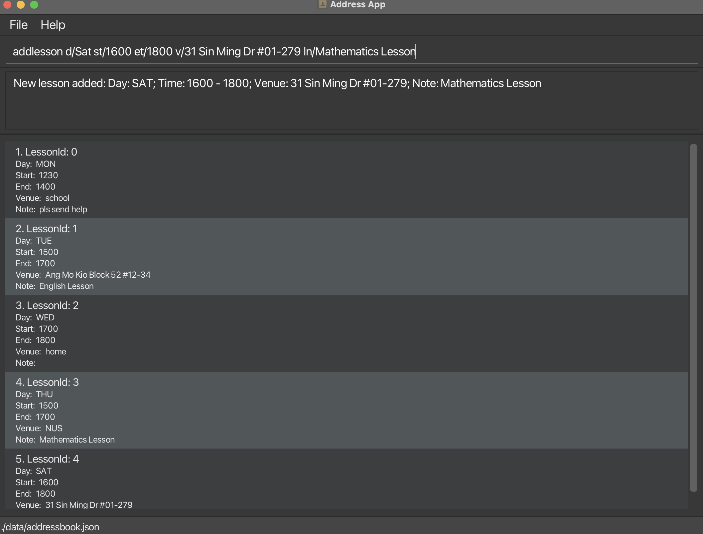
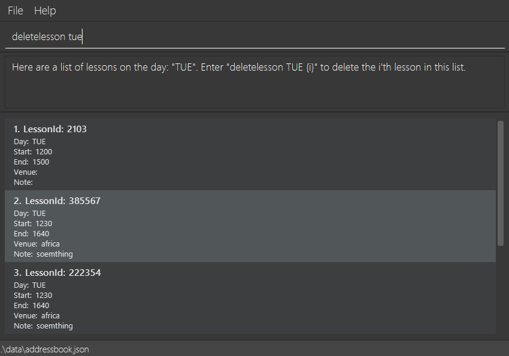
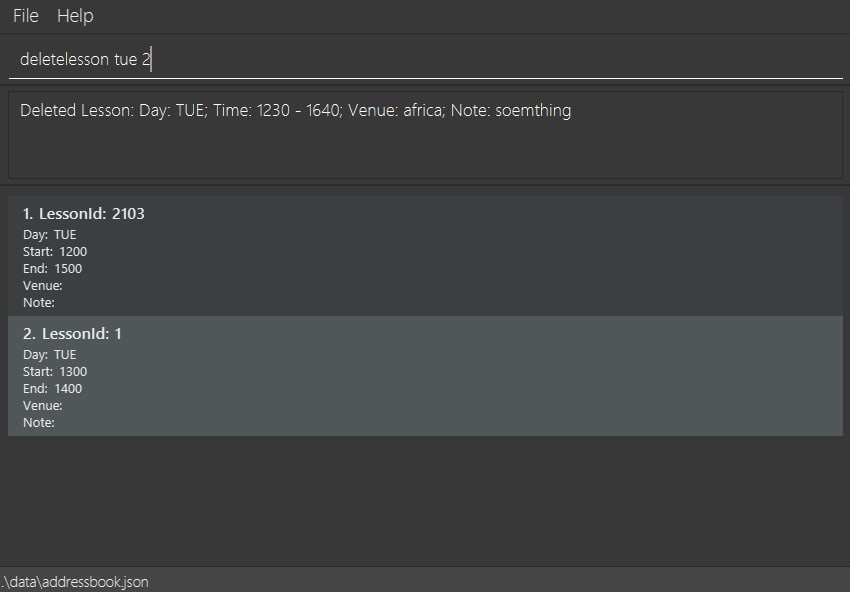
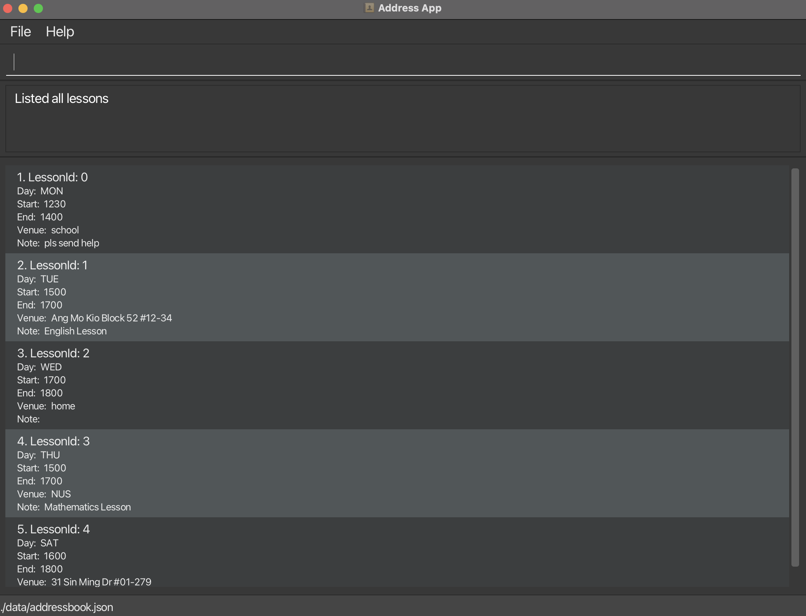
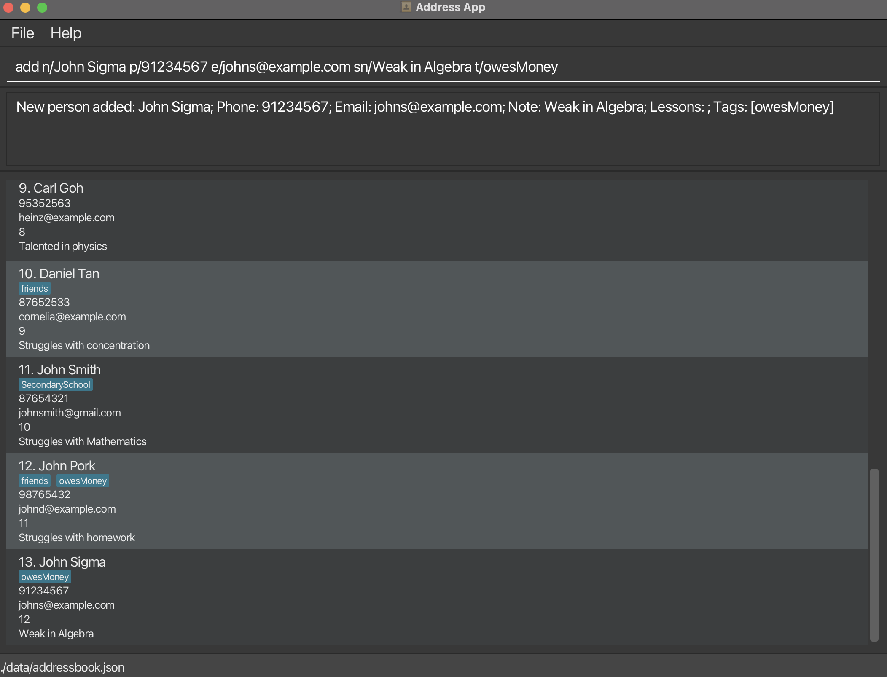
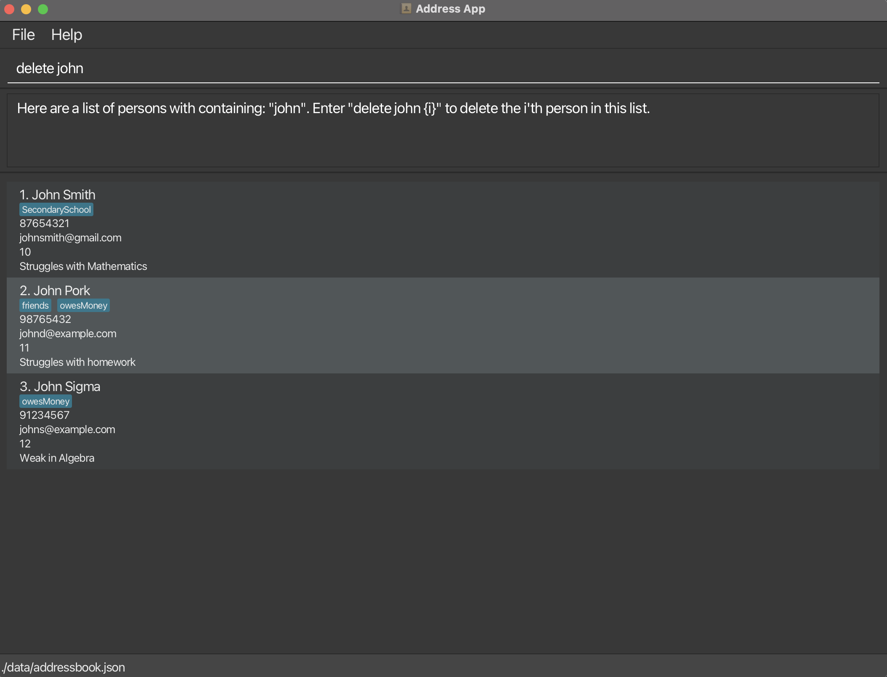
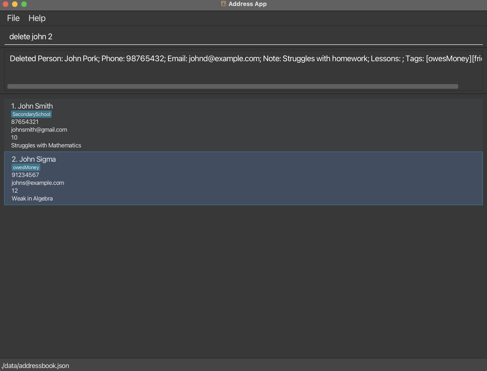
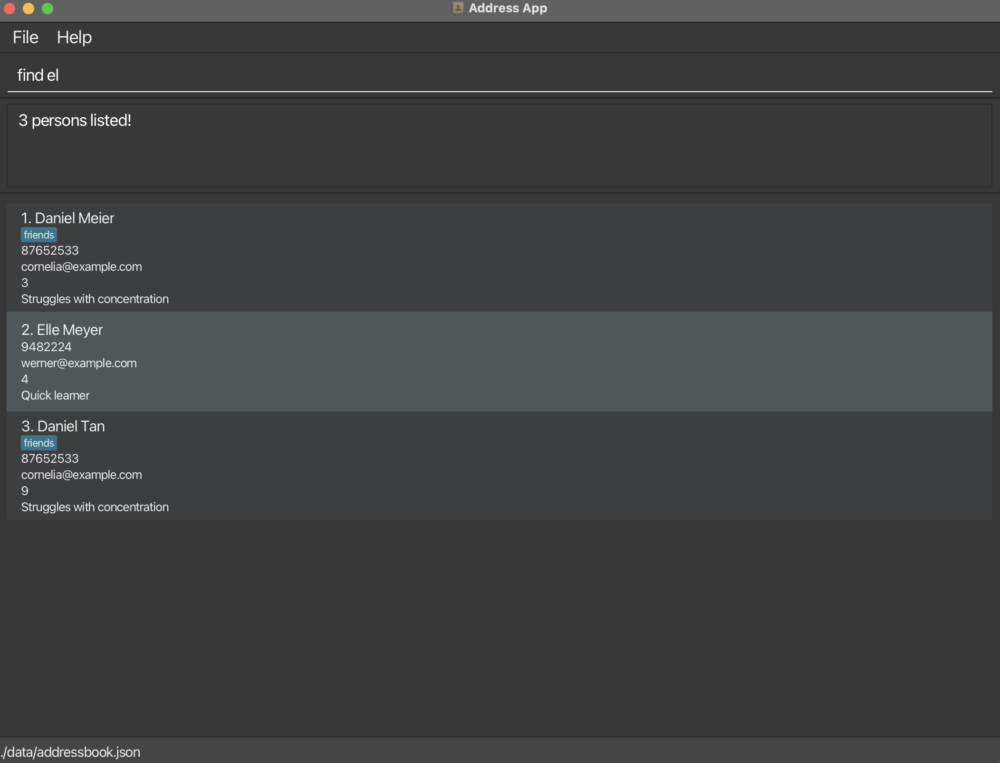

# EduLink v1.3 - MVP Release

## Overview
EduLink v1.3 marks our **Minimum Viable Product (MVP)** release, expanding on the base AB3 product to include lesson operations.

## What's New

### 1. Adding a lesson: `addlesson`

Adds lessons to the address book.

Format: `addlesson d/DAY st/START_TIME et/END_TIME v/VENUE ln/LESSON_NOTE`

_Note that `LESSON_NOTE` is optional_

Examples:
* `addlesson d/Tue st/1500 et/1700 v/Ang Mo Kio Block 52 #12-34 ln/English Lesson`
* `addlesson d/Sat st/1600 et/1800 v/31 Sin Ming Dr #01-279`

### 2. Deleting a lesson: `deletelesson`

Deletes the specified lesson from the address book.

Format: `deletelesson DAY INDEX`

* The list of lessons will be filtered based on the `DAY` provided first.
* The lesson specified at `INDEX` in this filtered list will be deleted.
* Entering `deletelesson DAY` will display the filtered list referenced for deletion, **without** deleting the actual lesson.
* `INDEX` **must be a positive integer**.

Examples:
* `deletelesson tue 2` deletes the 2nd lesson with day `TUE` in the results of `deletelesson tue`

### 3. Listing all lessons: `listlesson`

Shows a list of all lessons in the address book.

Format: `listlesson`

## Changes to Existing Features

### 1. Adding a student: `add`

Adds a student to the address book. 

Format: `add n/NAME p/PHONE_NUMBER e/EMAIL sn/STUDENT_NOTES [t/TAG]`

Changes:
* The address parameter `a/` has been replaced by student notes `sn/` instead.
* It is optional to include student notes, and the prefix may be omitted if no student notes is to be tagged to the student.

Examples:
* `add n/John Doe p/98765432 e/johnd@example.com sn/Struggles with homework t/friends t/owesMoney`
* `add n/John Pork p/87654321 e/johnp@example.com t/friends t/owesMoney`
* `add n/John Tan p/97867564 e/johnt@example.com sn/Weak in Algebra`
* `add n/John Sigma p/91234567 e/johns@example.com`

### 2. Deleting a student: `delete`

Deletes the specified student from the address book.

Format: `delete NAME INDEX`

Changes:
* Since students are now identified by a unique User ID, duplicate names are now allowed. 
* To delete a student with the same name, the list of students will now be filtered based on the `NAME` provided first.
* The student specified at `INDEX` in this filtered list will be deleted.
* Entering `delete NAME` will display the filtered list referenced for deletion, **without** deleting the actual student.
* `INDEX` **must be a positive integer**.

Examples:
* `delete John 2` deletes the 2nd person named John in the results of `delete John`.

### 3. Locating students by name: `find`

Finds students whose name contains the given keyword.

Format: `find KEYWORD`

Changes:
* `KEYWORD` no longer requires full word matching
* `find KEYWORD` will return a list of all students such that each student's name contains `KEYWORD`.
    e.g. `jo` will match `John` and `d` will list all students whose names contain the letter `d`
* `KEYWORD` may contain spaces, and spaces will be taken into account during matching. **Spaces are not ignored or removed**.
    e.g. `lic jon` will match `Alice Jones`, but not `Alice Jane`.

Examples:
* `find joh` returns `john` and `Johannes Tan`
* `find la jon` returns `Kayla Jones` and `Mikaela Jonathans`

